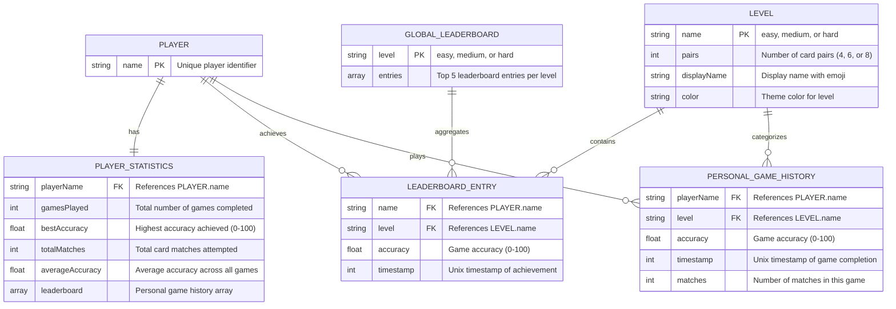

# Entity Relationship Diagram - EduMemory Card Game

## Overview
This document describes the data model and entity relationships for the EduMemory Card Game application, which uses a key-value store database pattern with Supabase.

---

## Entity Relationship Diagram



---

## Entities

### 1. PLAYER
Represents a unique player in the game system.

**Attributes:**
- `name` (Primary Key): Unique player identifier entered at game start

**Storage:**
- Players are implicitly created when they first play
- No dedicated storage; identified through statistics and leaderboard entries

**Notes:**
- Player names are case-sensitive
- Players re-enter their name after each page refresh
- Each unique name is treated as a separate player

---

### 2. PLAYER_STATISTICS
Stores cumulative statistics for each individual player.

**Attributes:**
- `playerName` (Foreign Key): References PLAYER.name
- `gamesPlayed`: Total count of completed games
- `bestAccuracy`: Highest accuracy percentage achieved (0-100)
- `totalMatches`: Cumulative number of card match attempts
- `averageAccuracy`: Calculated average accuracy across all games
- `leaderboard`: Array of personal game history entries

**Storage Key Pattern:**
```
stats:{playerName}
```

**Storage Value:**
```json
{
  "gamesPlayed": 5,
  "bestAccuracy": 100,
  "totalMatches": 45,
  "averageAccuracy": 87.5,
  "leaderboard": [
    {
      "level": "easy",
      "accuracy": 100,
      "timestamp": 1701523200000,
      "matches": 8
    }
  ]
}
```

**Relationships:**
- One-to-One with PLAYER
- One-to-Many with PERSONAL_GAME_HISTORY (embedded as array)

---

### 3. PERSONAL_GAME_HISTORY
Embedded within PLAYER_STATISTICS, tracks individual game sessions.

**Attributes:**
- `playerName` (Foreign Key): References PLAYER.name
- `level` (Foreign Key): References LEVEL.name (easy/medium/hard)
- `accuracy`: Percentage accuracy for the game (0-100)
- `timestamp`: Unix timestamp when game was completed
- `matches`: Number of card match attempts in the game

**Storage:**
- Embedded as an array within PLAYER_STATISTICS
- Sorted by timestamp descending (newest first)
- No limit on number of entries

**Relationships:**
- Many-to-One with PLAYER
- Many-to-One with LEVEL

---

### 4. LEADERBOARD_ENTRY
Represents a top-5 global leaderboard entry for a specific difficulty level.

**Attributes:**
- `name` (Foreign Key): References PLAYER.name
- `level` (Foreign Key): References LEVEL.name
- `accuracy`: Achievement accuracy percentage (0-100)
- `timestamp`: Unix timestamp of the achievement

**Storage Key Pattern:**
```
leaderboard:{level}
```

**Storage Value:**
```json
[
  {
    "name": "Alice",
    "accuracy": 100,
    "level": "easy",
    "timestamp": 1701523200000
  },
  {
    "name": "Bob",
    "accuracy": 95,
    "level": "easy",
    "timestamp": 1701436800000
  }
]
```

**Ranking Logic:**
1. All 100% accuracy scores are ranked first
2. Among 100% scores: Latest timestamp ranks higher (most recent = Rank #1)
3. Among non-100% scores: Highest accuracy ranks higher
4. Tie-breaker for non-100%: Earliest timestamp ranks higher

**Constraints:**
- Maximum 5 entries per level
- Automatically pruned when new entry is added

**Relationships:**
- Many-to-One with PLAYER
- Many-to-One with LEVEL
- Aggregated by GLOBAL_LEADERBOARD

---

### 5. LEVEL
Represents the three difficulty levels available in the game.

**Attributes:**
- `name` (Primary Key): "easy", "medium", or "hard"
- `pairs`: Number of card pairs (4, 6, or 8)
- `displayName`: Display name with emoji (e.g., "🟢 Easy")
- `color`: Theme color code for the level

**Hard-coded Values:**

| Name   | Pairs | Display Name | Color       |
|--------|-------|--------------|-------------|
| easy   | 4     | 🟢 Easy      | #34d399     |
| medium | 6     | 🟡 Medium    | #fbbf24     |
| hard   | 8     | 🔴 Hard      | #ef4444     |

**Storage:**
- Not stored in database (hard-coded constants)
- Referenced by other entities

**Relationships:**
- One-to-Many with LEADERBOARD_ENTRY
- One-to-Many with PERSONAL_GAME_HISTORY

---

### 6. GLOBAL_LEADERBOARD
Aggregates top leaderboard entries for each difficulty level.

**Attributes:**
- `level` (Primary Key): "easy", "medium", or "hard"
- `entries`: Array of top 5 LEADERBOARD_ENTRY objects

**Storage:**
- Same as LEADERBOARD_ENTRY (conceptual grouping)

**Relationships:**
- One-to-Many with LEADERBOARD_ENTRY

---

## Relationships

### 1. PLAYER ↔ PLAYER_STATISTICS (1:1)
- **Type:** One-to-One
- **Description:** Each player has exactly one statistics record
- **Cardinality:** A player must have statistics; statistics must belong to a player
- **Implementation:** Statistics are created on first game completion

### 2. PLAYER ↔ PERSONAL_GAME_HISTORY (1:N)
- **Type:** One-to-Many
- **Description:** A player can play multiple games over time
- **Cardinality:** A player can have 0 or more game history entries
- **Implementation:** Game history is embedded within PLAYER_STATISTICS

### 3. PLAYER ↔ LEADERBOARD_ENTRY (1:N)
- **Type:** One-to-Many
- **Description:** A player can have multiple entries in global leaderboards
- **Cardinality:** A player can have 0 to 3 entries (one per difficulty level)
- **Implementation:** Stored in separate leaderboard keys per level

### 4. LEVEL ↔ LEADERBOARD_ENTRY (1:N)
- **Type:** One-to-Many
- **Description:** Each difficulty level has its own leaderboard with up to 5 entries
- **Cardinality:** A level must have 0 to 5 leaderboard entries
- **Implementation:** Filtered by level field in leaderboard entries

### 5. LEVEL ↔ PERSONAL_GAME_HISTORY (1:N)
- **Type:** One-to-Many
- **Description:** Each game session is categorized by difficulty level
- **Cardinality:** A level can be associated with 0 or more game sessions
- **Implementation:** Level field in game history entries

---

## Database Storage Schema

### Key-Value Store Pattern

The application uses Supabase's key-value store with the following key patterns:

| Key Pattern              | Value Type | Description                        |
|--------------------------|------------|------------------------------------|
| `stats:{playerName}`     | JSON       | Player statistics and game history |
| `leaderboard:easy`       | JSON Array | Top 5 easy level leaderboard       |
| `leaderboard:medium`     | JSON Array | Top 5 medium level leaderboard     |
| `leaderboard:hard`       | JSON Array | Top 5 hard level leaderboard       |

### Example Data Flow

**When a player completes a game:**

1. **Fetch** player statistics: `GET stats:Alice`
2. **Calculate** new statistics values
3. **Add** game to personal history array
4. **Update** player statistics: `SET stats:Alice`
5. **Check** if score qualifies for global leaderboard
6. **Fetch** global leaderboard: `GET leaderboard:easy`
7. **Insert** new entry and re-sort
8. **Keep** top 5 entries only
9. **Update** global leaderboard: `SET leaderboard:easy`

---

## Data Integrity Rules

### Player Statistics
- `gamesPlayed` ≥ 0
- `bestAccuracy` range: 0-100
- `totalMatches` ≥ 0
- `averageAccuracy` range: 0-100
- `leaderboard` array: unlimited size, sorted by timestamp descending

### Leaderboard Entry
- `accuracy` range: 0-100
- `level` must be: "easy", "medium", or "hard"
- `timestamp` must be valid Unix timestamp
- Maximum 5 entries per level

### Personal Game History
- `accuracy` range: 0-100
- `matches` must be: 8 (easy), 12 (medium), or 16 (hard)
- `timestamp` must be valid Unix timestamp

---

## Indexing and Query Patterns

### Common Queries

1. **Get player statistics:**
   ```typescript
   kv.get(`stats:${playerName}`)
   ```

2. **Get global leaderboard for level:**
   ```typescript
   kv.get(`leaderboard:${level}`)
   ```

3. **Get all leaderboards:**
   ```typescript
   kv.mget(['leaderboard:easy', 'leaderboard:medium', 'leaderboard:hard'])
   ```

4. **Update player statistics:**
   ```typescript
   kv.set(`stats:${playerName}`, JSON.stringify(statsObject))
   ```

5. **Update leaderboard:**
   ```typescript
   kv.set(`leaderboard:${level}`, JSON.stringify(leaderboardArray))
   ```

### Performance Considerations

- **No joins required:** Key-value pattern eliminates need for complex queries
- **Atomic updates:** Each entity is updated independently
- **Denormalized data:** Player names duplicated across statistics and leaderboards
- **No cascade deletes:** Manual cleanup required if player data needs deletion

---

## Migration and Evolution Notes

### Current Limitations
1. No foreign key constraints (KV store limitation)
2. No transactions (updates are not atomic across multiple keys)
3. Player names cannot be changed (would require key migration)
4. No player deletion functionality

### Future Considerations
1. **Player profiles:** Could add `player:{name}` key for additional profile data
2. **Global statistics:** Could add `global:stats` key for overall game metrics
3. **Achievements:** Could add `achievements:{playerName}` for badge system
4. **Game sessions:** Could add `session:{sessionId}` for detailed game state tracking
5. **Leaderboard history:** Could add `leaderboard:{level}:history` for historical rankings

---

## Cardinality Summary

```
PLAYER (1) ─────────── (1) PLAYER_STATISTICS
PLAYER (1) ─────────── (N) PERSONAL_GAME_HISTORY
PLAYER (1) ─────────── (N) LEADERBOARD_ENTRY
LEVEL (1)  ─────────── (N) LEADERBOARD_ENTRY
LEVEL (1)  ─────────── (N) PERSONAL_GAME_HISTORY
```

---

## Document Version
- **Version:** 1.0
- **Last Updated:** December 2, 2025
- **Author:** EduMemory Development Team
